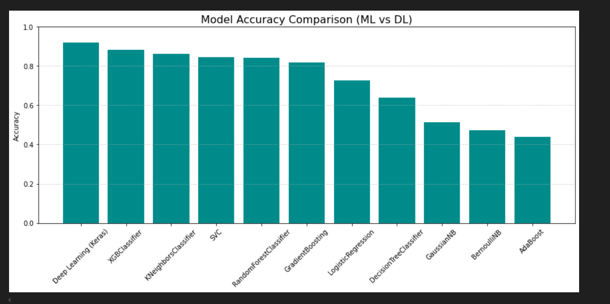

# 🎵 Music Genre Classification

This project focuses on classifying music genres using both traditional Machine Learning algorithms and a Deep Learning model built with Keras. It includes audio feature extraction, model training, evaluation, and performance comparison with visualizations.

## 📁 Dataset

- **Source**: [GTZAN Music Genre Dataset](https://www.kaggle.com/datasets/andradaolteanu/gtzan-dataset-music-genre-classification)
- **Contents**:
  - `.wav` audio files across 10 genres
  - Mel Spectrograms
  - Extracted features saved as CSV
---
## 🧠 Models Used

### ✅ Traditional ML Models:
- GaussianNB
- BernoulliNB
- KNeighborsClassifier
- DecisionTreeClassifier
- RandomForestClassifier
- XGBoostClassifier
- GradientBoostingClassifier
- AdaBoostClassifier
- LogisticRegression
- SVC


---
### ✅ Deep Learning Model (Keras Sequential):
- Dense layers with ReLU activations
- BatchNormalization & Dropout
- Final Softmax output layer for 10 genres
---
## 📊 Results

| Model                   | Accuracy     |
|------------------------|--------------|
| Deep Learning (Keras)  | 91.09%       |
| XGBoostClassifier       | 88.36%       |
| KNeighborsClassifier    | 86.31%       |
| SVC                     | 84.34%       |
| RandomForestClassifier  | 84.19%       |
| ...                    | ...          |

### 📈 Accuracy Comparison



---

> 📌 Conclusion: Deep learning and tree-based ensemble models (like XGBoost, RF) perform best on complex audio features.
---
## 📌 Key Features

- Mel spectrogram visualization using `librosa`
- Model performance comparison using `matplotlib`
- Clean and modular code for training and evaluation
---
## 🚀 How to Run

1. Clone this repo:
   ```bash
   git clone https://github.com/Theepankumargandhi/music-genre-classification.git
 
